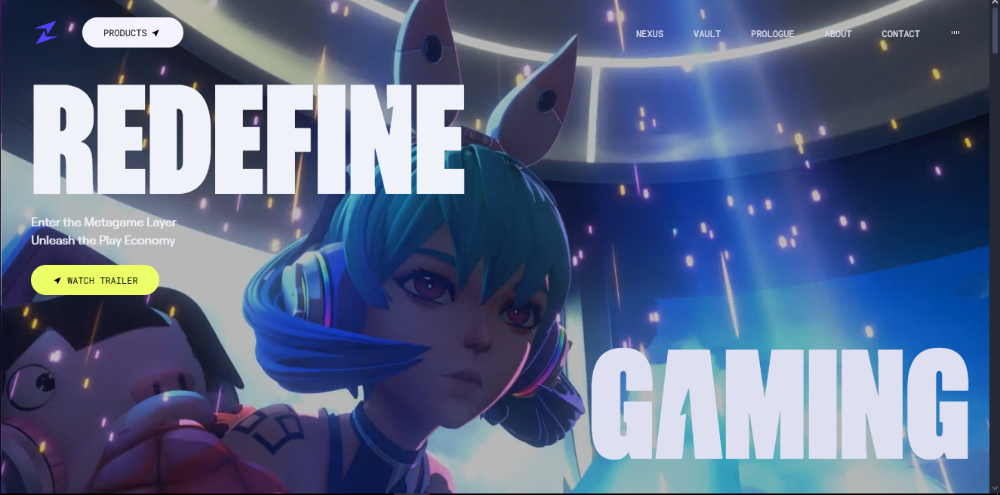
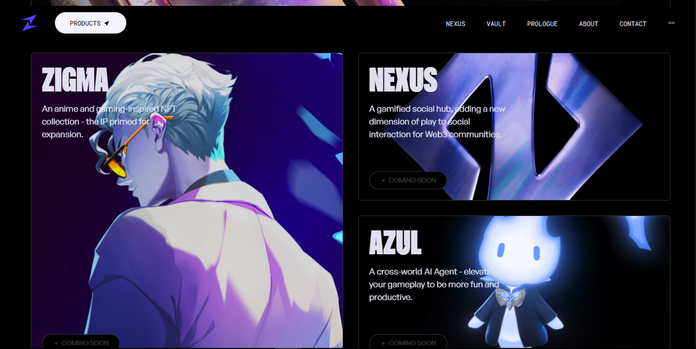

# Zentry by Rafa

  
[🔗 Acesse o site](https://zentry-byrafa.netlify.app)

## Sobre o Projeto

Este é um site desenvolvido como um experimento inspirado no site vencedor do Awwwards, que homenageou o jogo **Zentry**. O projeto foi criado utilizando tecnologias modernas para proporcionar uma experiência visual e interativa fluida.

## Tecnologias Utilizadas

- **React.js** → Biblioteca JavaScript para a construção da interface do usuário.
- **Tailwind CSS** → Framework CSS utilitário para estilização rápida e responsiva.
- **GSAP (GreenSock Animation Platform)** → Biblioteca para animações avançadas, garantindo transições suaves e interativas.

## Funcionalidades e Destaques

- **Design Moderno**: Inspirado em tendências de UI premiadas.
- **Animações Avançadas**: Implementadas com GSAP para proporcionar fluidez nas interações.
- **Responsividade Total**: Utilizando Tailwind CSS para garantir compatibilidade em diversos dispositivos.

## Capturas de Tela




## Repositório no GitHub

[🔗 Acesse o código-fonte](https://github.com/seuusuario/zentry-byrafa)

## Como Rodar o Projeto

1. Clone o repositório:
   ```bash
   git clone https://github.com/seuusuario/zentry-byrafa.git
   ```
2. Acesse a pasta do projeto:
   ```bash
   cd zentry-byrafa
   ```
3. Instale as dependências:
   ```bash
   npm install
   ```
4. Execute o projeto:
   ```bash
   npm start
   ```
5. Acesse no navegador: `http://localhost:3000`

---
**Desenvolvido por Rafaela Campos** 🚀


# React + Vite

This template provides a minimal setup to get React working in Vite with HMR and some ESLint rules.

Currently, two official plugins are available:

- [@vitejs/plugin-react](https://github.com/vitejs/vite-plugin-react/blob/main/packages/plugin-react/README.md) uses [Babel](https://babeljs.io/) for Fast Refresh
- [@vitejs/plugin-react-swc](https://github.com/vitejs/vite-plugin-react-swc) uses [SWC](https://swc.rs/) for Fast Refresh
